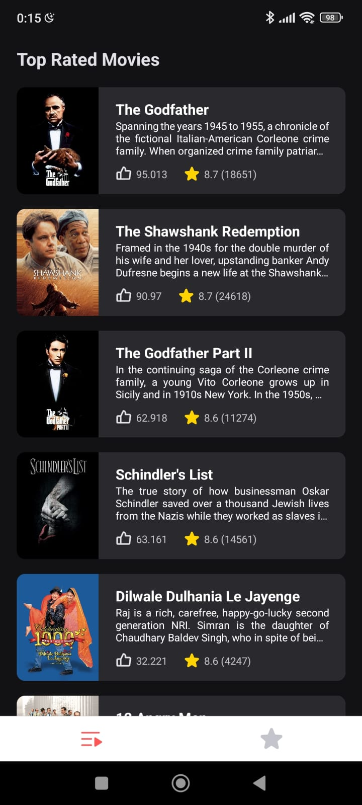
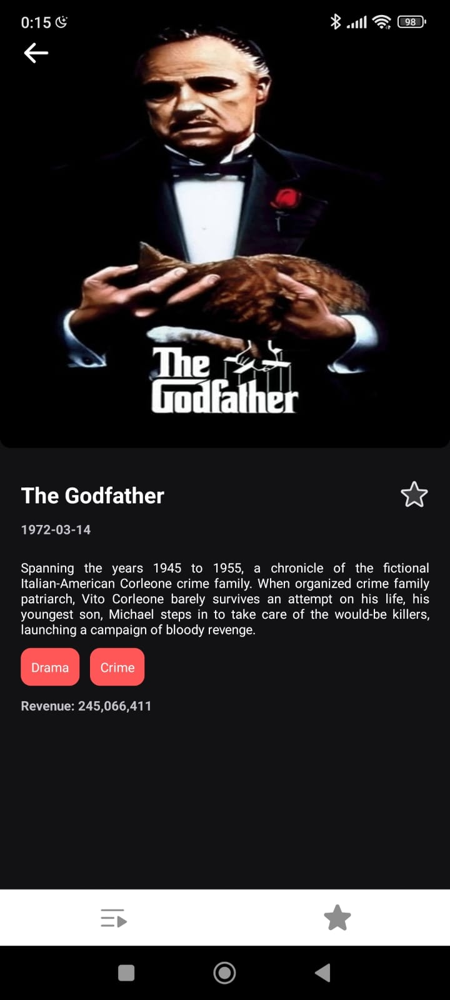

<div align="center" style="padding-bottom:30px; background:transparent">
  
  
</div>

## 💻 Project - Go Movies

> Go Movies was a challenge created by OTO and made by me.

## 🧑‍💻 Functionalities

- Infinity scroll of movies with "Pull to refresh"
- When pressing any card, navigate to a screen with more information about the movie
- It's possible to favorite each movie that you like
- You can see your favorite movies by pressing the "Star Button" in the bottom tab
- You can delete each movie or delete them all in one time. (You can delete pressing the button or dragging the card to right)

## 🚀 Technologies used

- [React Native](https://reactnative.dev/)
- [Expo](<[https://reactnative.dev/](https://expo.dev/accounts/niubajr19)>)
- [Typescript](https://www.typescriptlang.org)
- [Styled Components](https://styled-components.com/)
- [Redux Toolkit](https://redux.js.org/)
- [Async Storage](https://docs.expo.dev/versions/latest/sdk/async-storage/)
- [Phosphor Icons](https://phosphoricons.com/)
- [Module Resolver](https://www.npmjs.com/package/babel-plugin-module-resolver)
- [Eslint](https://eslint.org/) [Prettier](https://prettier.io/)
- [.env files](https://www.npmjs.com/package/react-native-dotenv)

### Getting Started

> You must have installed npx to run expo projects.

Clone the project repository

> [https://github.com/LucasAnP/GoMovies](https://github.com/LucasAnP/GoMovies)

Access the project directory

```
cd GoMovies
and
cd app
```

Install the dependencies

```
yarn
  or
npm install
```

Start the APP

```
npx expo start
```

## 📄 License

[MIT LICENSE](https://opensource.org/license/mit/)

> This is a challenge by OTO
